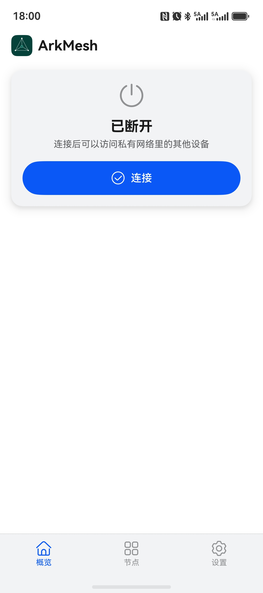
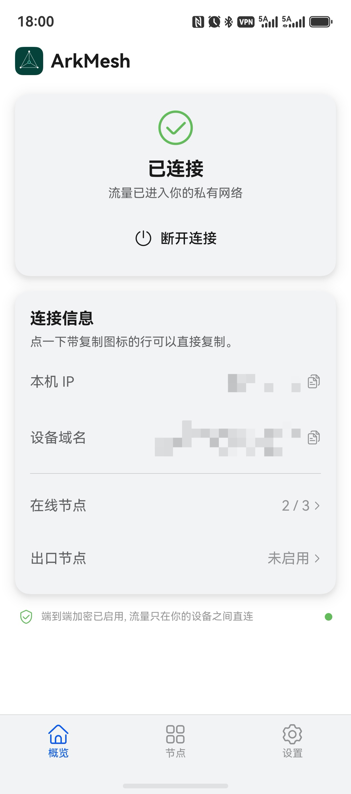
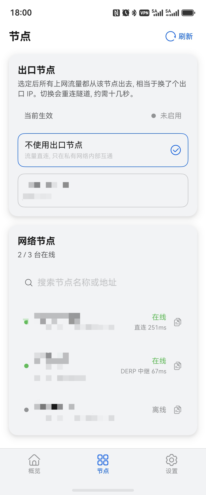
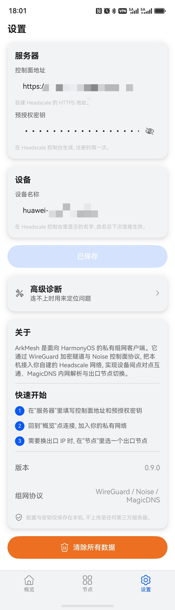

# ArkMesh

**HarmonyOS NEXT 上的 Tailscale 客户端，支持连接自建 Headscale 服务器**

[中文](#中文说明) | [English](#english)

---

## 中文说明

### 项目简介

ArkMesh 是一款专为 HarmonyOS NEXT 设计的开源 VPN 客户端，支持连接您自建的 [Headscale](https://github.com/headscale-devs/headscale) 服务器，让您轻松构建跨设备的私有网络。

基于 Tailscale 协议生态，采用 WireGuard 数据面 + Noise 控制面架构，在鸿蒙平台上实现了完整的 Mesh VPN 能力。

### 功能特性

- **自建服务器** — 连接任意 Headscale 服务器，数据不经过第三方
- **WireGuard 隧道** — 军事级别的加密通信协议
- **Noise 控制面** — 与 Headscale 服务器之间的安全注册与密钥协商
- **STUN / NAT 穿透** — 自动发现公网端点，P2P 直连更高效
- **节点管理** — 实时查看网络中所有设备的在线状态与连接信息
- **预认证密钥** — 支持 Auth Key 快速注册新设备，无需人工确认
- **Exit Node** — 支持将流量通过指定节点路由
- **后台保活** — VPN 连接持久化，切换应用不断线
- **多设备适配** — 支持手机、平板、2in1 设备

### 截图

| 首页 — 未连接 | 首页 — 已连接 | 节点列表 | 设置 |
|:---:|:---:|:---:|:---:|
|  |  |  |  |


### 架构

```
┌─────────────────────────────────────┐
│         ArkTS UI Layer              │
│  HomeView · NodesView · SettingsView│
├─────────────────────────────────────┤
│        C++ NAPI Bridge              │
│  napi_init.cpp · arkmesh_core.cpp   │
├─────────────────────────────────────┤
│         Go Core (c-shared)          │
│  WireGuard · Noise · STUN · Control │
│       libarkmesh_core.so            │
├─────────────────────────────────────┤
│       HarmonyOS VPN Service         │
│      VpnExtensionAbility (TUN)      │
└─────────────────────────────────────┘
```

| 层级 | 技术 | 说明 |
|:---:|:---:|:---|
| UI | ArkTS | 声明式 UI，响应式状态管理 |
| 桥接 | C++ NAPI | Go ↔ ArkTS 双向通信 |
| 核心 | Go 1.26 (c-shared) | WireGuard 隧道 + Noise 协议 + STUN |
| 加密 | OpenSSL 3.0 | Curve25519 + ChaCha20-Poly1305 |
| VPN | VpnExtensionAbility | 系统级 TUN 接口 |

### 环境要求

| 工具 | 版本 | 说明 |
|:---|:---|:---|
| DevEco Studio | 5.0+ | HarmonyOS NEXT IDE |
| HarmonyOS SDK | API 12+ (6.1.0) | 含 NDK |
| Go | 1.26 (OHOS 定制版) | 仅构建 Go 核心时需要 |
| 真机 | HarmonyOS NEXT | 模拟器不支持 VPN Extension |

### 快速开始

#### 1. 克隆项目

```bash
git clone https://github.com/YOUR_USERNAME/ArkMesh.git
cd ArkMesh
```

#### 2. 构建 OpenSSL

OpenSSL 需要针对 OHOS 交叉编译，参考 [OpenSSL 构建指南](ohos/docs/OPENSSL_BUILD_GUIDE.md) 或使用 WSL 脚本：

```bash
cd ohos
bash build_openssl.sh
```

#### 3. 构建 Go 核心

需要 OHOS 定制版 Go 工具链（支持 `openharmony/arm64` 目标）：

```bash
export GOROOT=/path/to/ohos-go126/goroot
export OHOS_NDK=/path/to/DevEco-Studio/sdk/default/openharmony/native
export PATH="$GOROOT/bin:$PATH"

cd go/arkmesh-core
bash build.sh
```

构建脚本会自动将 `libarkmesh_core.so` 复制到 OHOS 工程的 `third_party/go/arm64-v8a/` 目录。

#### 4. 构建 HAP

用 DevEco Studio 打开 `ohos/` 目录：

1. 等待项目同步完成
2. 配置签名（Project Structure → Signing Configs）
3. Build → Build Hap(s) 或 Run 到真机

### Headscale 服务器配置

确保您的 Headscale 服务器满足以下条件：

1. **版本** 0.24.0+（需要支持 capver ≥ 113）
2. **可公网访问**，建议配置 HTTPS 证书
3. **生成预认证密钥**：

```bash
headscale preauthkeys create --reusable --expiration 90d
```

### 已知限制

- **DERP 中继**: 已内置 DERP 客户端，但中继路径取决于服务端配置
- **Split DNS**: OHOS 平台限制，第三方 App 无法解析 mesh 内部域名
- **模拟器**: 不支持 VPN Extension，必须使用真机测试

### 项目结构

```
ArkMesh/
├── go/arkmesh-core/          # Go 核心库 (c-shared → libarkmesh_core.so)
│   ├── main.go               # 入口，导出 C API
│   ├── control.go            # 控制面逻辑
│   ├── probe.go              # 网络/环境探针
│   ├── ohostun.go            # OHOS TUN 接口适配
│   └── build.sh              # 交叉编译脚本
│
├── ohos/                      # HarmonyOS NEXT 前端工程
│   ├── entry/src/main/
│   │   ├── ets/               # ArkTS 业务层
│   │   │   ├── core/          # 核心封装 (KeyManager, NetworkMonitor...)
│   │   │   ├── pages/         # 页面 (Index)
│   │   │   ├── view/          # 视图 (HomeView, NodesView, SettingsView)
│   │   │   └── vpn/           # VPN 扩展能力 (ArkMeshVpnAbility)
│   │   └── cpp/               # C++ NAPI 原生层
│   │       ├── napi_init.cpp  # NAPI 绑定入口
│   │       └── src/           # api/ bridge/ key/ noise/ stun/ wireguard/
│   └── build-profile.json5
│
└── docs/                      # 文档与截图
```

### 贡献

欢迎提交 Issue 和 Pull Request。详情请参考 [CONTRIBUTING.md](CONTRIBUTING.md)。

### 许可证

[MIT License](LICENSE)

---

## English

### Overview

ArkMesh is an open-source VPN client for **HarmonyOS NEXT**, designed to connect to self-hosted [Headscale](https://github.com/headscale-devs/headscale) servers. It brings Mesh VPN capabilities to the HarmonyOS platform using the Tailscale protocol ecosystem.

### Key Features

- Connect to any self-hosted Headscale server
- WireGuard encrypted tunnel + Noise control plane protocol
- STUN/NAT traversal for direct P2P connections
- Real-time node status monitoring
- Auth Key support for quick device registration
- Exit Node routing support
- Background VPN persistence

### Architecture

- **UI**: ArkTS declarative UI
- **Bridge**: C++ NAPI (Go ↔ ArkTS bidirectional communication)
- **Core**: Go 1.26 c-shared library (WireGuard + Noise + STUN)
- **Crypto**: OpenSSL 3.0 (Curve25519 + ChaCha20-Poly1305)
- **VPN**: VpnExtensionAbility (system-level TUN interface)

### Build

```bash
# 1. Build OpenSSL for OHOS (requires WSL or Linux)
cd ohos && bash build_openssl.sh

# 2. Build Go core (requires OHOS-patched Go toolchain)
export GOROOT=/path/to/ohos-go126/goroot
export OHOS_NDK=/path/to/sdk/default/openharmony/native
cd go/arkmesh-core && bash build.sh

# 3. Open ohos/ in DevEco Studio 5.0+ and build HAP
```

### Requirements

- DevEco Studio 5.0+
- HarmonyOS SDK API 12+ with NDK
- Go 1.26 (OHOS custom build, for Go core only)
- Physical HarmonyOS NEXT device (emulator does not support VPN Extension)

### License

[MIT License](LICENSE)
